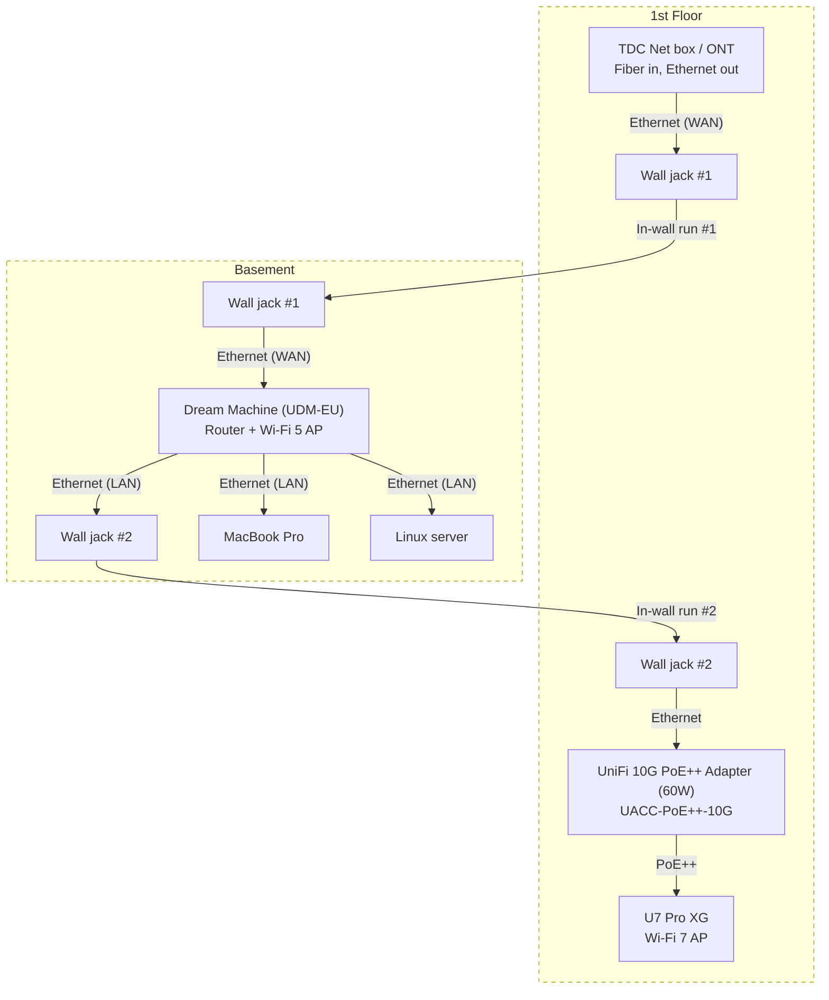
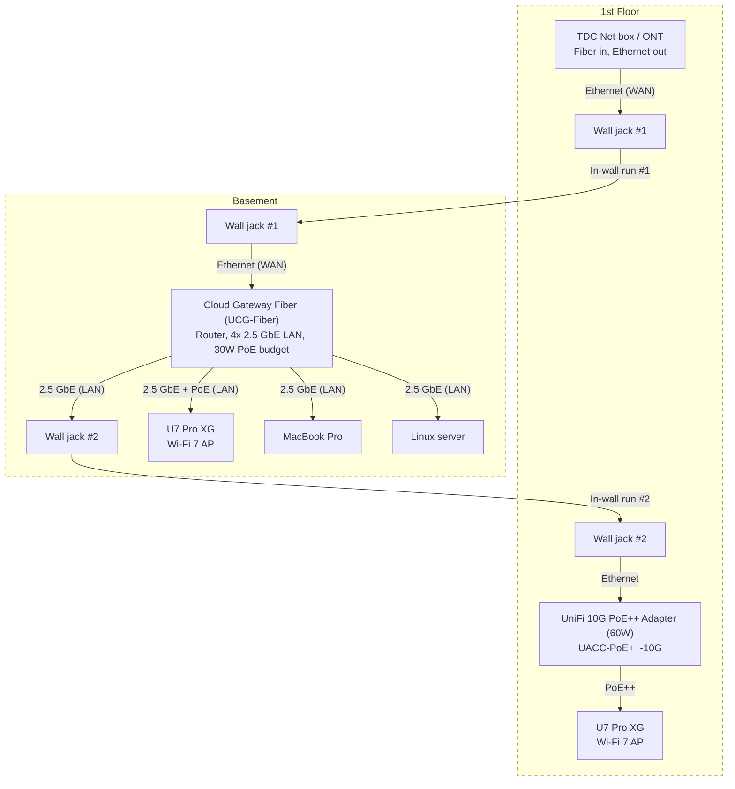

# Home Network Setup

This document explains different options for setting up my home network.

## Overview

- Provider: Fibernet with cables owned by TDC Net
- Access type: Fiber
- Internet plan: 1000 Mbps

## Unknowns

- **ONT Ethernet port speed:** If the ONT only has a 1 GbE Ethernet port, it becomes the bottleneck regardless of router or AP. Check the model number on the ONT label and look up its spec sheet.
- **In-wall Ethernet cable category:** The cable category in the wall sockets (Cat5e, Cat6, etc.) determines the max speed of the runs to the basement. Cat5e supports 1 GbE, Cat6 supports up to 10 GbE (short runs) or reliable 2.5 GbE. Check the cable jacket print or the wall socket markings.

## Terminology

- Router — a device that forwards traffic between networks (e.g. your LAN and the internet). It assigns local IP addresses (DHCP), performs NAT, and typically includes a firewall.
- Switch — a device that connects multiple Ethernet devices on the same local network. Unlike a router, it doesn't route between networks — it just forwards frames between its ports.
- UniFi Gateway — a router/firewall appliance from Ubiquiti's UniFi line (e.g. Dream Machine, UCG Fiber). It handles routing, NAT, DHCP, and acts as the central controller for other UniFi devices.
- Access point (AP) — a device that creates a Wi-Fi network and connects wireless clients to the wired LAN. Unlike a router, it doesn't do routing or NAT—it just bridges wireless traffic onto the Ethernet network.
- WAN (Wide Area Network) — the "internet side" of your router. The WAN port connects to your ISP's network (via the ONT), as opposed to LAN ports which connect to your local devices.
- PoE (Power over Ethernet) — delivers electrical power alongside data over an Ethernet cable, eliminating the need for a separate power adapter. Common standards: PoE (802.3af, 15W), PoE+ (802.3at, 30W), PoE++ (802.3bt, up to 60–100W).
- FTP (Fiber termination point) - A passive box where the street fiber terminates inside the house.
- ONT (Optical Network Terminal) - the active box that converts the optical signal to Ethernet

## Fiber & Ethernet sockets

1. Fiber enters through the wall into a TDC Net FTP
2. Short fiber patch cable from the FTP to a separate TDC Net ONT
3. Next to the TDC boxes are two wall ethernet sockets that run to the basement.

## Requirements

1. I want to wifi access points in both the 1st floor and basement.
2. In the basement I have a Macbook Pro and a Linux server that both need a wired ethernet connection.

## Relevant equipment

- Own today:
    - [Dream Machine EU Version from 2022 SKU UDM-EU](https://eu.store.ui.com/eu/en/products/udm)
    - [U7 Pro XG](https://eu.store.ui.com/eu/en/category/wifi-flagship/products/u7-pro-xg?variant=u7-pro-xg)
- Would have to buy, depending on the setup I choose
    - [Cloud Gateway Fiber](https://eu.store.ui.com/eu/en/category/cloud-gateways-compact/collections/cloud-gateway-fiber/products/ucg-fiber)
    - [10G PoE++ Adapter (60W)](https://eu.store.ui.com/eu/en/category/accessories-poe-power/collections/pro-store-poe-and-power-adapters/products/uacc-poe-plus-plus-10g)

## Option A

Dream Machine in the basement, U7 Pro XG on the 1st floor. Uses both in-wall Ethernet runs: one carries WAN down to the UDM, the other carries LAN back up to the AP.

### Topology

### How it works

- **In-wall run #1 (WAN):** ONT Ethernet out → 1st floor jack → basement jack → UDM WAN port.
- **In-wall run #2 (LAN):** UDM LAN port → basement jack → 1st floor jack → PoE++ adapter → U7 Pro XG.
- **Wired devices:** MacBook Pro and Linux server plug directly into the UDM's remaining LAN ports (it has 4× GbE LAN).
- **Wi-Fi:** UDM provides Wi-Fi 5 coverage in the basement. U7 Pro XG provides Wi-Fi 7 on the 1st floor.

### Limitations

- All UDM LAN ports are 1 GbE, so the U7 Pro XG's 10 GbE uplink is underutilized (capped at ~940 Mbps). The 1000 Mbps internet plan still fits within this ceiling, so WAN throughput is unaffected.
- The UDM's built-in AP is Wi-Fi 5 — adequate for the basement but noticeably slower than the Wi-Fi 7 AP upstairs.
- The PoE++ adapter's data input also appears to be 1 GbE based on its spec sheet, reinforcing the 1G ceiling.
- The in-wall Ethernet runs must be Cat5e or better for reliable Gigabit over the full distance. Cat6 is ideal.

### Equipment to buy

- UniFi 10G PoE++ Adapter (60W) (UACC-PoE++-10G-EU)
    - Sits on the 1st floor near wall jack #2
    - Injects PoE++ power to the U7 Pro XG over a short patch cable
- Patch cables
    - 1st floor: wall jack #2 → PoE++ adapter, PoE++ adapter → U7 Pro XG
    - Basement: wall jack #1 → UDM (WAN), UDM (LAN) → wall jack #2, UDM (LAN) → MacBook, UDM (LAN) → Linux server

## Option B

UCG Fiber in the basement (replaces the Dream Machine entirely), with two U7 Pro XG access points — one per floor. Uses both in-wall Ethernet runs: one carries WAN down to the UCG Fiber, the other carries LAN back up to the 1st floor AP.

### Topology

### How it works

- **In-wall run #1 (WAN):** ONT Ethernet out → 1st floor jack → basement jack → UCG Fiber WAN port (1 GbE RJ45 or via SFP+ with an RJ45 transceiver module).
- **In-wall run #2 (LAN):** UCG Fiber LAN port → basement jack → 1st floor jack → PoE++ adapter → U7 Pro XG upstairs.
- **Basement AP power:** The UCG Fiber has a 30W PoE budget across its LAN ports. The U7 Pro XG draws up to 22W and accepts PoE+ (802.3at), so the UCG Fiber can power the basement AP directly — no separate injector needed.
- **1st floor AP power:** The PoE budget is consumed by the basement AP (~22W of 30W), so the 1st floor AP needs an external PoE++ adapter.
- **Wired devices:** MacBook Pro and Linux server plug into the UCG Fiber's remaining 2.5 GbE LAN ports.
- **Wi-Fi:** Both floors get Wi-Fi 7 via dedicated U7 Pro XG access points. No built-in AP on the UCG Fiber — it's a gateway only.

### Advantages over Option A

- Wi-Fi 7 on both floors (Option A has Wi-Fi 5 in the basement via the UDM).
- 2.5 GbE LAN ports on the UCG Fiber vs 1 GbE on the UDM — faster local wired and AP uplink speeds.
- Cleaner separation of concerns: dedicated gateway + dedicated APs.
- UCG Fiber powers the basement AP directly via built-in PoE — one fewer device in the basement.

### Limitations

- The 30W PoE budget only covers one U7 Pro XG (~22W). The 1st floor AP still needs an external PoE++ adapter.
- The UCG Fiber's RJ45 WAN port is 1 GbE. With a 1000 Mbps internet plan this is fine, but it doesn't leave headroom. The SFP+ port supports 10G but would need an RJ45 transceiver if the in-wall run is Ethernet.
- Uses all 4 of the UCG Fiber's LAN ports (basement AP, MacBook, Linux server, upstairs run). No spare ports without adding a switch.
- The in-wall Ethernet runs must be Cat5e or better for reliable Gigabit. Cat6 for 2.5 GbE.

### Equipment to buy

- Cloud Gateway Fiber (UCG-Fiber) — replaces the Dream Machine
- Second U7 Pro XG — for the basement (you already own one for the 1st floor)
- 1× UniFi 10G PoE++ Adapter (60W) (UACC-PoE++-10G-EU) — for the 1st floor AP only (basement AP is powered by the UCG Fiber's built-in PoE)
    - 1st floor: between wall jack #2 and 1st floor U7 Pro XG
- Patch cables
    - Basement: wall jack #1 → UCG Fiber (WAN), UCG Fiber (LAN) → basement AP, UCG Fiber (LAN) → MacBook, UCG Fiber (LAN) → Linux server, UCG Fiber (LAN) → wall jack #2
    - 1st floor: wall jack #2 → PoE++ adapter, PoE++ adapter → U7 Pro XG
